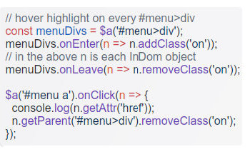
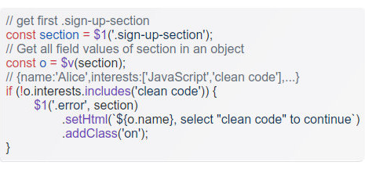

#  - 3.7KB modern JavaScript DOM library - powerful, easy and automates cleanup [](https://github.com/constcallid/indom/LICENSE)



- **Lightweight:** Only **3.7KB gzipped** – adds minimal overhead.

- **Complete Innovative DOM Solution:** Comprehensive API with single-instance objects per element – eliminating duplication and boosting performance for element selection, manipulation, traversal, event handling and more. 

- **Modern JavaScript:** Built with ES2022, empowers clean and maintainable code.

- **Powerful Cleanup:** State (event listeners, data, etc.) **automatically** removed when elements are destroyed. Leak-proof by design, no need for manual cleanup to avoid memory leaks. 

- **Stack Agnostic:** Set events with InDom, remove elements with any library (an older JS DOM library, a modern large JS framework, etc.) – cleanup still happens automatically. This allows gradual adoption of InDom at any pace.

- **Fast & Dependency-Free:** Optimized for performance with zero external dependencies.

- **Modern Browser Support:** Compatible with all modern browsers (see browser support for more).

- **Powerful Fields Handling:** Advanced form field handling with automatic type normalization and validation.

- **Multiple Formats:** Distributed in Plain JavaScript, ESM modules, and TypeScript formats.

- **TypeScript Ready:** Includes built-in types (ES2022 compatible) available in `/src`.


## 📋 API Reference

### Core Methods [→](#api-reference)
[Shortcuts](#shortcuts-for-convenience) | [getOne](#indomgetoneselector-container) | [get](#indomgetselector-container) | [getById](#indomgetbyidid) | [new InDom](#new-indomsource) | [onReady](#indom-onready-fn)

### Value Methods [→](#api-reference)
[getValue](#getvalue-container) | [getValues](#indom-getvalues-args) | [setValue](#setvalue-value-container)

### Events [→](#api-reference)
[on/onClick](#on-type-fn-opts) | [onRemove](#onremove-fn) | [off](#off-type-fn)

### DOM Manipulation [→](#api-reference)  
[getElement](#getelement-el) | [remove](#remove) | [is](#is-selector) | [getParent](#getparent-selector) | [getNext](#getnext-selector) | [getPrev](#getprev-selector) | [append](#append-children) | [prepend](#prepend-children) | [after](#after-siblings) | [before](#before-siblings)

### Data [→](#api-reference)
[setData](#setdata-key-value) | [getData](#getdata-key) | [hasData](#hasdata-key) | [removeData](#removedata-key)

### Attributes & Styling [→](#api-reference)
[setAttr](#setattr-key-value) | [getAttr](#getattr-key) | [hasAttr](#hasattr-key) | [removeAttr](#removeattr-key) | [getBox](#getbox) | [getOuterBox](#getouterbox) | [getRelativeBox](#getrelativebox) | [addClass](#addclass-names) | [hasClass](#hasclass-name) | [removeClass](#removeclass-names) | [setStyle](#setstyle-property-map-value) | [getStyle](#getstyle-properties)

## Table of Contents
- ** API **
<hr>
[Shortcuts](#shortcuts-for-convenience) | [getOne **`$1`**](#indomgetoneselector-container) | [get **$a**](#indomgetselector-container) | [getById **$id**](#indomgetbyidid) | [new InDom **$n**](#new-indomsource) | [onReady](#indom-onready-fn)

[getValue](#getvalue-container) | [getValues **$v**](#indom-getvalues-args) | [setValue](#setvalue-value-container)

[on (+ onClick , onEnter etc.)](#on-type-fn-opts) | [onRemove](#onremove-fn) | [off](#off-type-fn)

[getElement](#getelement-el) | [remove](#remove) | [is](#is-selector) | [getParent](#getparent-selector) | [getNext](#getnext-selector) | [getPrev](#getprev-selector) | [append](#append-children) | [prepend](#prepend-children) | [after](#after-siblings) | [before](#before-siblings)

[setData](#setdata-key-value) | [getData](#getdata-key) | [hasData](#hasdata-key) | [removeData](#removedata-key) | [setAttr](#setattr-key-value) | [getAttr](#getattr-key) | [hasAttr](#hasattr-key) | [removeAttr](#removeattr-key)

[getBox](#getbox) | [getOuterBox](#getouterbox) | [getRelativeBox](#getrelativebox) | [addClass](#addclass-names) | [hasClass](#hasclass-name) | [removeClass](#removeclass-names)  | [setStyle](#setstyle-property-map-value) | [getStyle](#getstyle-properties)
<hr>
- **API**
	- [Shortcuts for convenience](#shortcuts-for-convenience)
	- [InDom.getOne](#indomgetoneselector-container) - **$1**
	- [InDom.get](#indomgetselector-container) - **$a**
	- [InDom.getById](#indomgetbyidid) - **$id**
	- [new InDom](#new-indomsource) - **$n**
	- [InDom.onReady](#indom-onready-fn)
	- [.getValue](#getvalue-container)
	- [InDom.getValues](#indom-getvalues-args) - **$v**
	- [.setValue](#setvalue-value-container)
	- [.on + .onClick , onEnter etc.](#on-type-fn-opts)
	- [.onRemove](#onremove-fn)
	- [.off](#off-type-fn)
	- [.setData](#setdata-key-value)
	- [.getData](#getdata-key)
	- [.hasData](#hasdata-key)
	- [.removeData](#removedata-key)
	- [.getElement / .el](#getelement-el)
	- [.remove](#remove)
	- [.is](#is-selector)
	- [.getParent](#getparent-selector)
	- [.getSelfOrParent](#getselforparent-selector)
	- [.getNext](#getnext-selector)
	- [.getPrev](#getprev-selector)
	- [.setHtml](#sethtml-content)
	- [.getHtml](#gethtml)
	- [.append](#append-children)
	- [.prepend](#prepend-children)
	- [.after](#after-siblings)
	- [.before](#before-siblings)
	- [.setAttr](#setattr-key-value)
	- [.getAttr](#getattr-key)
	- [.hasAttr](#hasattr-key)
	- [.removeAttr](#removeattr-key)
	- [.getBox](#getbox)
	- [.getOuterBox](#getouterbox)
	- [.getRelativeBox](#getrelativebox)
	- [.addClass](#addclass-names)
	- [.hasClass](#hasclass-name)
	- [.removeClass](#removeclass-names)
	- [.setStyle](#setstyle-property-map-value)
	- [.getStyle(...properties?)](#getstyle-properties)
	
<br>


## API


### Shortcuts for convenience
The convenience shortcuts ($1, $a, $id, $n, $v) are optional and can be renamed, scoped differently, or removed entirely based on your preferences.

[↑TOC](#table-of-contents)

### `InDom.getOne(selector, container?)`
Shortcut: **$1**

Queries the DOM using the CSS selector and returns an `InDom` object that contains the matching DOM element.
Returns `null` if no matching element is found.

**Parameters:**
- `selector` {string}: CSS selector string
- `container` {ParentNode|InDom} (optional): The container element or InDom object to search within. Defaults to `document`.

**Returns:** `InDom | null`

**Examples:**
```js
$1('.example>div').setStyle('color', 'blue');
/*
	If .example>div doesn't match any element, $1('.example>div') will return null.
	Attempting to call a method on null will result in a TypeError.
	If you want to avoid this error when the element is not found,
	use the optional chaining operator (?.) e.g.:
*/
$1('.example>div')?.setStyle('color', 'blue');

$1('.example>div').onClick(n => {
	//n here is the InDom object
	n.addClass('clicked').setStyle({ 'color': 'red', 'font-size': '120%' });
});

// Set style to the first 'span', of the first '.example>div'
$1('span', $1('.example>div')).setStyle('color', 'green');

//or:
const div = $1('.example>div');
$1('span', div).setStyle('color', 'green');
```

[↑TOC](#table-of-contents)

### `InDom.get(selector, container?)`
Shortcut: **$a**

Queries the DOM using the CSS selector and returns an `InDomArray` of `InDom` objects for each matching DOM element.
Returns an empty `InDomArray` if no matching elements are found.

**Parameters:**
- `selector` {string}: CSS selector string
- `container` {ParentNode|InDom} (optional): The container element or InDom object to search within. Defaults to `document`.

**Returns:** `InDomArray`

**Examples:**
```js
// Set style on every '.example'
$a('.example').setStyle('color', 'blue');

// Set click event on every '.example>span'
$a('.example>span').onClick(n => {
	n.setStyle('color','green');
});

const example1 = $1('.example');
//Set data 'init': 1 on direct children 'div' of the first '.example'
$a('>div', example1).setData('init', 1);

//InDomArray objects themselves don't have get* methods
//Get the left and top of each '.example>div' relative to viewport
$a('.example>div').each(n => {
	// .getBox() returns the bounding box
	const box = n.getBox();
	console.log(`left:${box.left} top:${box.top}`);
});
```

[↑TOC](#table-of-contents)

### `InDom.getById(id)`
**Shortcut:** <span style="color:#04281c;text-shadow:0px 0px 1px;">$id</span>

Fetches the element with the specified ID and returns an `InDom` object that contains it.
Returns `null` if no element with the given ID is found.

**Parameters:**
- `selector` {string} id - The ID of the element to fetch

**Returns:** `InDom | null`

**Examples:**
```js
// You could get the InDom object by its ID using the general selector method:
const example1 = $1("#test"); 

// But it's more efficient, especially in HTML documents with many DOM elements,
// to get it directly by ID:
const example2 = $id("test");

```

[↑TOC](#table-of-contents)

### `new InDom(source)`
Shortcut: **$n**

Creates a new `InDom` object from a given underlying DOM element or an HTML string representing a DOM element.

**Parameters:**
- `source` {Document|Element|string}: DOM Element or HTML string of a DOM element

**Returns:** `InDom` - New `InDom` object or an existing one (if one already exists for the given source element).

**Throws:**
- `TypeError`: If the source is not a valid DOM Element, the document or HTML string of one DOM Element

**Examples:**
```js
// Example 1
const img2 = $n(
	'');
$1('.img-example-2').append(img2);

// Example 2
const container = $id('img-container');
const btn = $1('>.btn', container);
/** @type {InDom} */
let img;

// Define the click handler for the button (no need for the InDom object 
// or the event arguments here).
// It either loads an image for the first time or toggles the image source 
// on subsequent clicks.
btn.onClick(() => {

	// Image has not been loaded/created yet
	if (!img) {
		// Check if an image load is already in progress to prevent duplicate requests.
		if (btn.getData('loading') === 1) {
			btn.setHtml('the image is loading...');
			// Exit the handler early as no further action is needed.
			return;
		}

		// Create a native HTML Image object.
		const imgEl = new Image();

		// Define the callback for when the image finishes loading successfully.
		imgEl.onload = () => {
			// Wrap the loaded native image element in an InDom object
			img = $n(imgEl);
			img.setAttr('alt', 'a star image example');
			// Append the InDom-wrapped image to the container element.
			container.append(img);
			btn.setData('loading', 0).setHtml('change img');
		};

		// Configure the image source and initial properties.
		imgEl.src = 'example-star.png';
		imgEl.width = 50;
		imgEl.height = 50;

		// Set a flag on the button to indicate that an image load is now in progress.
		btn.setData('loading', 1);
		// Exit the handler as the load process has started.
		// Note: A production implementation should also handle img.onerror etc.
		return;
	}

	// Image already exists, toggle its source
	// Check the current src to determine which image to switch to.
	if (img.getAttr('src') == "example-cloud.png") {
		// If it's currently showing the 'cloud' image, switch to the 'star' image.
		img.setAttr('src', 'example-star.png')
			.setAttr('alt', 'a star image example');
		// Exit after that
		return;
	}
	// It is a 'star', switch to the 'cloud' image.
	img.setAttr('src', 'example-cloud.png')
		.setAttr('alt', 'a cloud image example');
	return;
});


// Notice
const test1 = $n('<div><span>one single parent element</span></div>');
// will work , but: 
try {
	const test2 =
		$n('<div><span>div 1</span></div><div><span>div 2</span></div>');
	// will throw a TypeError because you can create one InDom object only for one element 
}
catch (e) {
	console.log(e);
}
// in case you need to insert multiple elements set the HTML of the parent element 
// or append / prepend HTML to it , and then get the InDom object you want: e.g. 
$1('.example>div')
	.setHtml('<div><span>div 1</span></div><div><span>div 2</span></div>');
const test3 = $1('.example>div>div:nth-child(2)');
test3.setStyle('color', 'blue');


//InDom objects are created only once for the same DOM element
const a = $1('.example');
const b = $1('.example');
if (a === b) {
	console.log('it\'s the same object');
}
```

[↑TOC](#table-of-contents)

### `InDom.onReady(fn)`

Registers a function to run when DOM is ready (or immediately if already ready).

**Parameters:**
- `fn` {function}

**Throws:**
- `TypeError`: If `fn` handler is not a function 

**Examples:**
```js
// If the JavaScript file (containing InDom) is loaded and executed before the HTML DOM 
// content is fully parsed, attempting to select elements immediately might fail because 
// they don't exist yet. Additionally, adding event listeners to elements that haven't 
// been parsed yet will also fail. Use the InDom.onReady() function to ensure your code 
// runs only after the DOM is fully loaded and ready.

InDom.onReady(() => {
    // Safe to use InDom for quering DOM elements and attach event listeners here
    $1('.example').addClass('on');
});
```

[↑TOC](#table-of-contents)


### `.getValue(container?)`
**Available on:** `InDom`

Returns the current value of the element, normalized for its type.
- Single value inputs (`input`, `textarea`, etc.): string or `null`.
- `select` (single): string or `null`.
- `select` (multiple): array of selected values or empty array.
- `input[type=checkbox]` (same name group): array of checked values.
- `input[type=radio]` (same name group): string of the checked value or `null`.
- `input[type=file]` (single or multiple): `FileList` object (zero or more files).

**Parameters:**
- `container` {Document|Element|InDom} (optional) - Scope for checkbox and radio group lookups. When provided, only searches within this container for related elements. Defaults to `document`.

**Returns:**
- {string|string[]|FileList|null} string for single values, array for multiple/select, FileList for file inputs, `null` when no selection or the element lacks a `value` property

**Throws:**
- `Error`: If the underlying element has been removed  

**Examples:**
```html
<div class="input-examples">
	<div><input type="text" name="username" value=""></div>
</div>
```
<details><summary>view full HTML</summary>

```html
<div class="input-examples">
	<div><input type="text" name="username" value=""></div>
	<div><textarea name="message"></textarea></div>
	<div>
		<select name="color">
			<option value="red">Red</option>
			<option value="green" selected>Green</option>
			<option value="blue">Blue</option>
		</select>
	</div>
	<div>	
		<select name="size" multiple>
			<option value="s">Small</option>
			<option value="m">Medium</option>
			<option value="l">Large</option>
		</select>
	</div>
	<div>
		<input type="radio" name="payment" value="credit" id="credit">
		<label for="credit">Credit Card</label>
		<input type="radio" name="payment" value="debit" id="debit">
		<label for="debit">Debit Card</label>
		<input type="radio" name="payment" value="paypal" id="paypal">
		<label for="paypal">PayPal</label>
	</div>
	<div>
		<input type="checkbox" name="features" value="wifi" id="wifi">
		<label for="wifi">WiFi</label>
		<input type="checkbox" name="features" value="bluetooth" id="bluetooth">
		<label for="bluetooth">Bluetooth</label>		
		<input type="checkbox" name="features" value="gps" id="gps">
		<label for="gps">GPS</label>		
	</div>
	<div>
		<input type="file" name="documents" multiple accept=".pdf,.doc,.docx">
	</div>
</div>
```
</details>

```js
const container = $1('.input-examples');

// Iterate through each direct child <div> within the container.
$a('>div', container).each(div => {
    // Find the first child element within the current div.
    // Based on the HTML structure, this is the actual field input/textarea/select/etc.
    const field = $1('>*', div);

    // Create a button 
    const btn = $n("<span class='btn'>log value</span>");

    // Append the button to the current div so it sits next to the field.
    div.append(btn);

    // Attach a click event listener to the button.
    btn.onClick(() => {
        // When the button is clicked, log the field's name and its current value.
        console.log(`name: ${field.getAttr("name")} value:`);

        // Call the getValue() method on the field and log the result.
        // The output will vary based on the type of field and its current state.
        console.log(field.getValue());
        
        /*
        Expected outputs based on initial HTML state:
        - input "username" -> string 
        - textarea "message" -> string
        - select "color" -> string (selected color)
        - select "size" multiple -> array of strings (selected sizes), empty if none selected
        - radio "payment" -> string (selected payment), null if none selected
        - checkbox "features" -> array of strings (selected features), empty if none selected
        - file "documents" -> FileList object, empty if none selected with .length 0
        */			
    });
});
```

[↑TOC](#table-of-contents)


