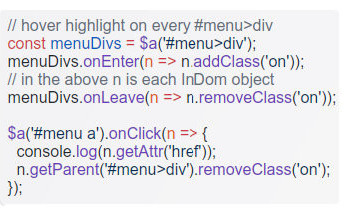
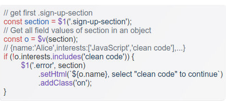

# InDom - 3.7KB modern JavaScript DOM library - powerful, easy and automates cleanup

- **Lightweight:** Only **3.7KB gzipped** – adds minimal overhead.

- **Complete Innovative DOM Solution:** Comprehensive API with single-instance objects per element – eliminating duplication and boosting performance for element selection, manipulation, traversal, event handling and more. 

- **Modern JavaScript:** Built with ES2022, empowers clean and maintainable code.

- **Powerful Cleanup:** State (event listeners, data, etc.) **automatically** removed when elements are destroyed 

- **Stack Agnostic:** Leak-proof by design, no need for manual cleanup to avoid memory leaks. Set events with InDom, remove elements with any library (an older JS DOM lib, a modern large JS framework, etc.) – cleanup still happens automatically

- **Fast & Dependency-Free:** Optimized for performance with zero external dependencies.

- **Modern Browser Support:** Compatible with all modern browsers (see browser support for more).

- **Powerful Fields Handling:** Advanced form field handling with automatic type normalization and validation.

- **Multiple Formats:** Distributed in Plain JavaScript, ESM modules, and TypeScript formats.

- **TypeScript Ready:** Includes built-in types (ES2022 compatible) available in `/src`.

